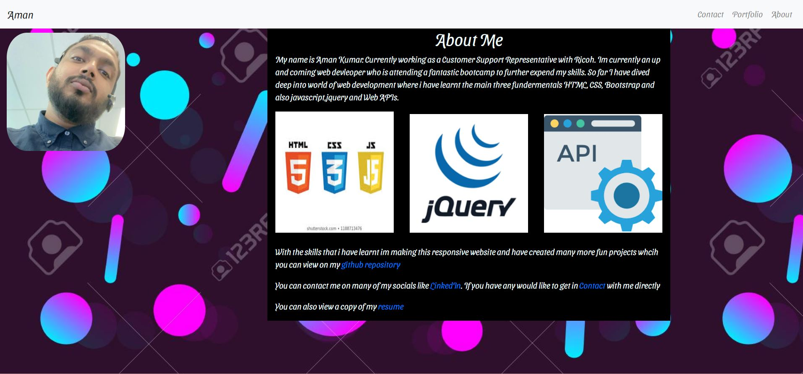
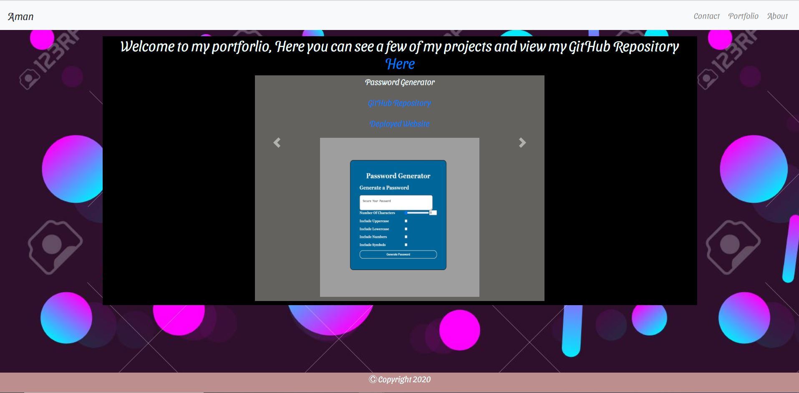
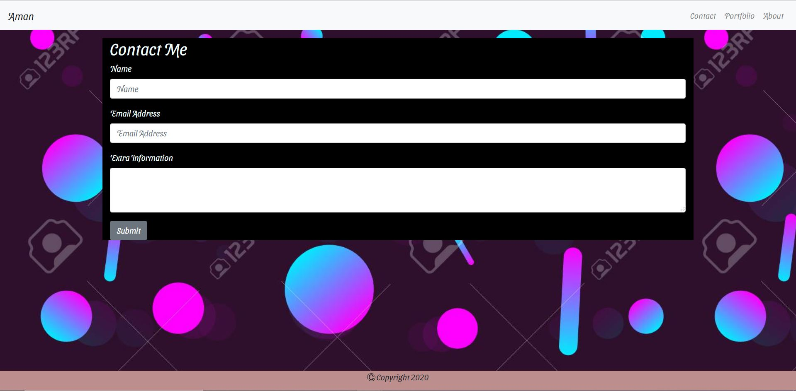

# TITLE
Updated Portfolio

This is a web-page made using HTML, CSS and Bootstrap.
​
## Contents

The web-site is composed of 4 pages, index.html ,portfolio.html , contact.html and styles.css. It also has images in the img folder

​
## User Story

As a web developer, I wanted to create a web page portfolio to show the skills I have been learning over this bootcamp.
So I am able to show my skills and get interest from employers.

​
## Built With
​
* [VScode](https://code.visualstudio.com/) - The editor of choice
* [Terminal](https://gitforwindows.org/) - Git Bash
* [Terminal](https://getbootstrap.com//) - Bootstrap
​

#### Initial interface and #### Final Interface

The following image demonstrates the application functionality:

​
​
### Licence
​
I have provided a License document on the Git Repository
​
​
### Licence
​
Licence is attached with the Portfolio_hw_2 folder
​
### Link to the App
<a href="https://amankmr4.github.io/UpdatedPortfolio/">Link to the Website</a>
https://amankmr4.github.io/UpdatedPortfolio/

Link to Repository
<a href="https://github.com/amankmr4/UpdatedPortfolio.git">Link to the GitRepository</a>
https://github.com/amankmr4/UpdatedPortfolio.git

​
## Authors
​
* **Aman Kumar** - 
aman.kmr4@yahoo.com
+614024940267

